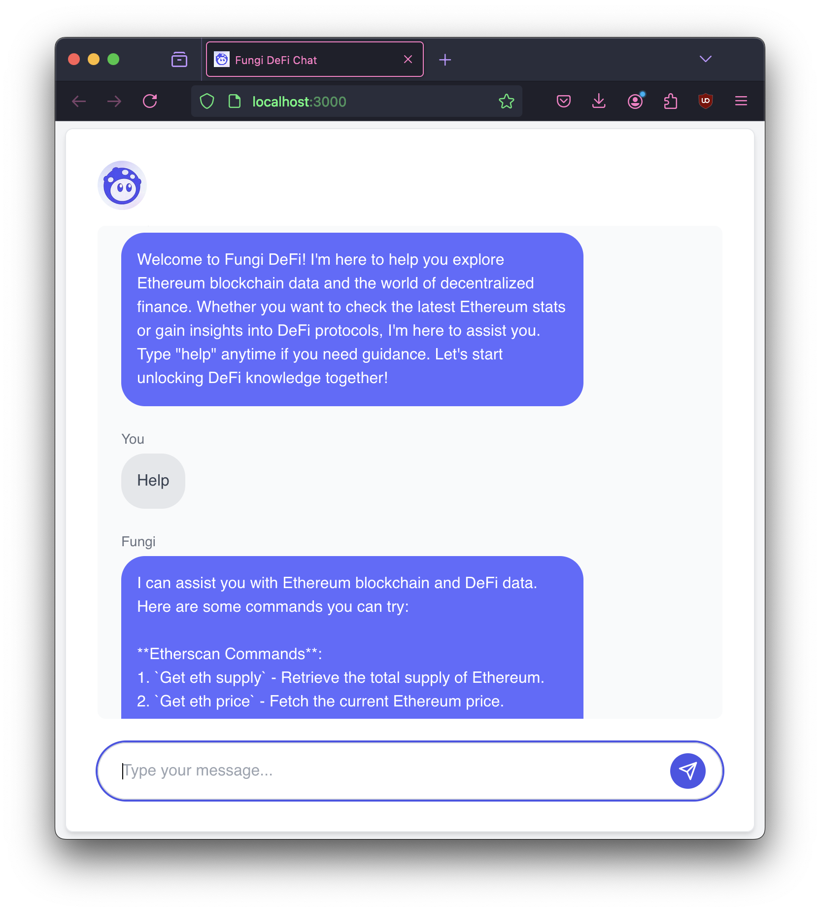

# Fungi DeFi Chatbot ??

A conversational chatbot designed to assist users with decentralized finance (DeFi) questions. This project integrates a Python-based FastAPI backend and a Next.js frontend to provide quick, resourceful responses to user queries on DeFi topics.

## Table of Contents

- [Demo Screenshot](#demo-screenshot)
- [Design & Development Choices](#design--development-choices)
  - [Backend: FastAPI](#backend-fastapi)
  - [Frontend: Next.js with Tailwind CSS](#frontend-nextjs-with-tailwind-css)
  - [Chatbot NLP Integration](#chatbot-nlp-integration)
  - [State Management: React Context API](#state-management-react-context-api)
  - [Testing Frameworks: Jest and Pytest](#testing-frameworks-jest-and-pytest)
- [Setup & Usage Instructions](#setup--usage-instructions)
  - [Backend Setup](#backend-setup-fastapi)
  - [Frontend Setup](#frontend-setup-nextjs)
  - [Running Tests](#running-tests)
- [Demo Video](#demo-video)

---

## Demo Screenshot



---

## Design & Development Choices

### Backend: FastAPI

The backend is built with FastAPI to support asynchronous operations, crucial for real-time DeFi data updates and API responses. This choice enables the chatbot to serve dynamic DeFi content such as token prices, yield farming details, and other decentralized finance insights. It implements Etherscan API for Ethereum blockchain data and DeFiLlama API for DeFi protocols.

- **FastAPI**: Chosen for speed, asynchronous request handling, and fast API development.
- **WebSocket Support**: Enables real-time communication for users, offering live updates on DeFi markets and exchanges.

### Frontend: Next.js with Tailwind CSS

The frontend is built with Next.js, leveraging its server-side rendering for fast load times and optimization. Tailwind CSS is used to create a clean, responsive design.

- **Next.js**: Server-side rendering for enhanced performance.
- **Tailwind CSS**: Provides utility-first CSS for quickly building responsive, modern UIs.

### Chatbot NLP Integration

Natural Language Processing (NLP) models power the chatbot?s intelligence, enabling it to interpret user queries and retrieve relevant DeFi information such as exchange rates, liquidity pools, or DeFi protocols. The model selected for this project is the HuggingFaceH4/zephyr-7b-beta model, which is fine-tuned on the Blended Skill Talk dataset.

### State Management: React Context API

State management is handled using React Context API, ensuring efficient session management without the need for external state libraries like Redux.

### Testing Frameworks: Jest and Pytest

The project employs a thorough testing strategy for both the frontend and backend.

- **Jest**: Used to test React components and ensure the frontend behaves as expected.
- **Pytest**: Ensures backend API endpoints and logic perform correctly.

---

## Setup & Usage Instructions

### Backend Setup (FastAPI)

1. Clone the repository:

   ```bash

    git clone https://github.com/AlvaroAlonso-0/fungi-chatbot.git
    cd fungi-chatbot

    ```

2. Install the required Python packages:

   ```bash

   pip install -r requirements.txt

   ```

3. Set the environment variables creatint a .env.local file in the  directory and add the following environment variables:

    ```bash
    // .env.local
    ETHERSCAN_API_KEY=your_etherscan_api_key

   ```

4. Run the FastAPI server:

   ```bash

   python main.py

   ```

5. The FastAPI server will start at `http://localhost:8000`.

### Frontend Setup (Next.js)

1. Install the required dependencies:

   ```bash

   npm install

   ```

2. Run the Next.js development server:

   ```bash

    npm run dev
    
    ```

3. The Next.js server will start at `http://localhost:3000`.

### Running Tests

1. To run the frontend tests:

   ```bash

   npm run test

   ```

2. To run the backend tests:

   ```bash

    pytest
    
    ```

---

## Demo Video

The following video demonstrates the chatbot in action:
[Demo Video](https://youtu.be/-NLH3tmKEXk)
